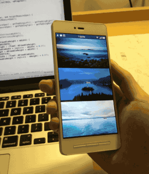
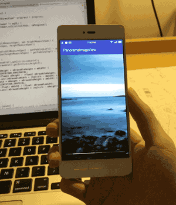

[](https://www.npmjs.com/package/nativescript-panorama-imageview)
[](https://www.npmjs.com/package/nativescript-panorama-imageview)

# NativeScript-Panorama-ImageView
Panoramic Image View for NativeScript that uses the device movement to pan the images.

## Native Library
 - *PanoramaImageView* - https://github.com/gjiazhe/PanoramaImageView

## Screens
 | 

## License
This plugin is licensed under the MITlicense by Brad Martin

## Installation
From your command prompt/termial go to your app's root folder and execute:

```
tns plugin add nativescript-panorama-imageview
```

## Usages
#### XML:
```XML
<Page xmlns="http://schemas.nativescript.org/tns.xsd" xmlns:PanoramaImageView="nativescript-panorama-imageview" loaded="pageLoaded">
    <ActionBar title="Panoramic ImageView" />
   <ScrollView>
        <StackLayout class="p-20">
            <PanoramaImageView:PanoramaImageView height="220" src="~/images/panSunset.jpg" />
            <PanoramaImageView:PanoramaImageView height="200" scrollbar="true" src="https://cdn.pixabay.com/photo/2016/11/23/18/29/cloudy-1854241_960_720.jpg" />
            <PanoramaImageView:PanoramaImageView height="240" src="https://cdn.pixabay.com/photo/2016/11/21/15/43/beach-1846040_960_720.jpg" />
        </StackLayout>
    </ScrollView>
</Page>
```

### Properties

- `scrollbar: boolean` *optional (default = false)* - if true a scrollbar will be visible on the image view.
